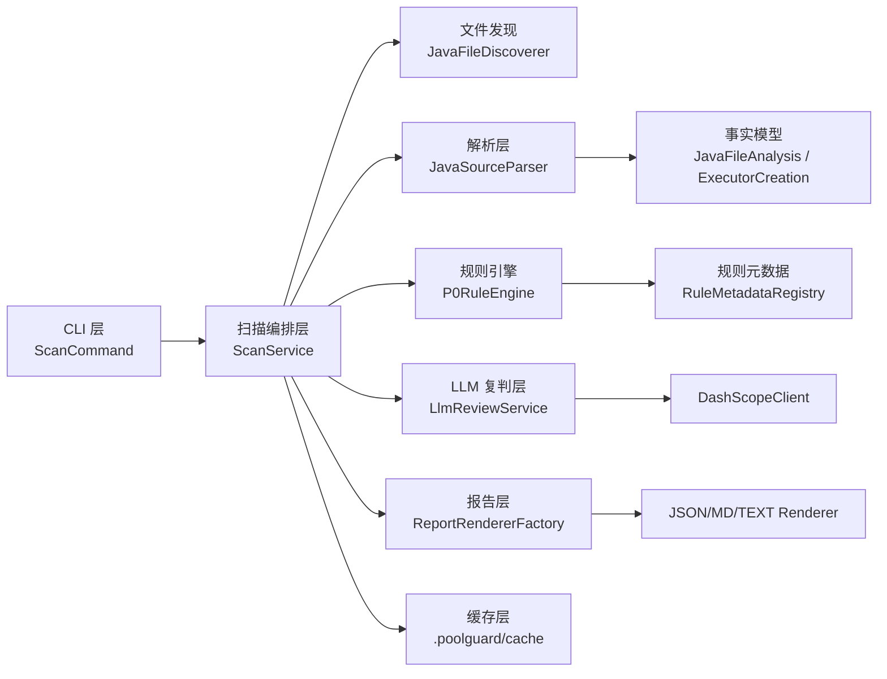
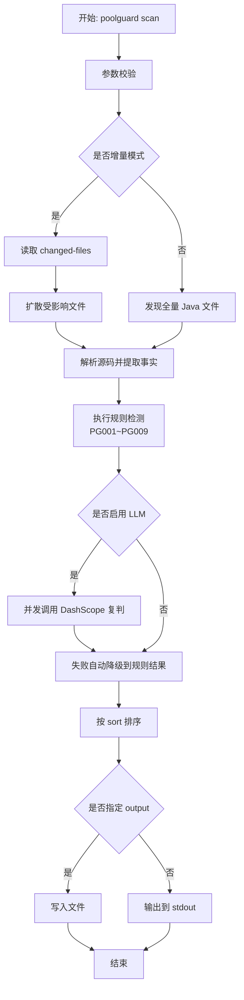

# PoolGuard

PoolGuard 是一个面向 Java 项目的线程池泄露扫描 CLI 工具，首期优先适配 Spring Boot 场景。

## 架构图



## 功能流程图



## 能力范围

- 仅扫描 `.java` 文件，解析器固定为 JavaParser。
- 输出格式：`json`（默认）、`md`（固定 `md-template-v1`）、`text`。
- LLM Provider 固定 DashScope，默认模型 `glm-5`，支持 `--llm-model` 覆盖。
- LLM 并发可配置：`--llm-concurrency`，默认 `3`。
- 支持全量扫描与增量扫描（`--changed-files`）。
- 支持缓存：文件哈希缓存（`.poolguard/cache/file-hash.properties`）。

## 已实现规则

说明：当前版本实际启用 8 条规则，编号沿用 `PG001 ~ PG009`（`PG004` 预留未启用）。

- `PG001`：高频入口方法内创建线程池
  经典例子：在 Spring `@RestController` 的接口方法里每次请求都 `Executors.newFixedThreadPool(...)`。
- `PG002`：循环/递归中重复创建线程池
  经典例子：在 `for/while` 重试循环或递归方法中反复 `new ThreadPoolExecutor(...)`。
- `PG003`：线程池未关闭或关闭路径不完整
  经典例子：方法里创建 `ExecutorService` 后直接 `return`，异常分支没有进入 `finally` 执行 `shutdown()`。
- `PG005`：生命周期不匹配（短生命周期对象持有线程池）
  经典例子：请求级对象或临时 Service 持有线程池字段，但类没有 `@PreDestroy`/`close` 生命周期回收逻辑。
- `PG006`：默认线程工厂不可观测
  经典例子：直接使用 `Executors.newCachedThreadPool()`，线程名全是默认格式，线上问题难以定位来源。
- `PG007`：无界队列风险（`LinkedBlockingQueue()`）
  经典例子：`ThreadPoolExecutor` 使用 `new LinkedBlockingQueue<>()`（不设容量），高峰期任务无限堆积。
- `PG008`：定时线程池未取消且未关闭
  经典例子：`scheduleAtFixedRate(...)` 提交周期任务后，既不 `future.cancel(...)` 也不 `shutdown()`。
- `PG009`：静态线程池缺少退出钩子
  经典例子：`private static final ExecutorService POOL = ...`，应用停止时没有注册 `shutdown hook` 或销毁方法。

## 风险分值口径

当前 `risk_score` 是规则默认分（非运行时动态计算），用于排序和快速分级，口径如下：

- `CRITICAL`：`90-95`（高概率真实泄露，且影响面大）
- `HIGH`：`75-89`（高风险，需要优先修复）
- `MEDIUM`：`55-69`（优化项，通常不阻断发布）

当前默认分：

- `PG001=80`
- `PG002=92`
- `PG003=95`
- `PG005=78`
- `PG006=60`
- `PG007=84`
- `PG008=80`
- `PG009=83`

## 环境要求

- JDK 8
- Maven 3.8+

## 快速开始

```bash
mvn clean package
```

```bash
# 默认 JSON 输出到 stdout
java -cp target/classes:$(mvn -q -DincludeScope=runtime dependency:build-classpath -Dmdep.path | tail -n 1) \
  cn.rqfreefly.Main scan --path .
```

## IDEA 使用

1. 导入项目
- `File -> Open`，选择项目根目录 `PoolGuard`。
- 等待 Maven 自动同步完成。

2. 配置 JDK 8
- `File -> Project Structure -> Project SDK` 选择 JDK 1.8。
- `Settings -> Build Tools -> Maven -> Runner -> JRE` 也选择 JDK 1.8。

3. 配置并运行主程序
- 打开 [Main.java](/Users/rongqing/Documents/code/PoolGuard/src/main/java/cn/rqfreefly/Main.java)。
- 点击运行 `Main.main()`，在 `Run Configuration` 中设置 `Program arguments`。
- 常用参数示例：
```text
scan --path . --format json
scan --path . --format md --output report.md
scan --path . --changed-files changed.txt --format json
```

4. 启用 LLM（可选）
- 在 `Run Configuration -> Environment variables` 增加：
```text
DASHSCOPE_API_KEY=<your_api_key>
```
- 对应参数示例：
```text
scan --path . --enable-llm --llm-model glm-5 --llm-concurrency 3
```

5. 在 IDEA 中执行测试与门禁
- Maven 面板执行：
```text
Lifecycle -> test
Lifecycle -> verify
```
- `verify` 会执行 JaCoCo 覆盖率门禁与 Checkstyle 规范检查。

## 命令说明

```bash
poolguard --help
poolguard scan --help
```

核心参数：

- `--path <dir|file>`：扫描路径
- `--format <json|md|text>`：输出格式，默认 `json`
- `--output <file>`：输出到文件，不传则打印到 stdout
- `--sort <severity|score|path>`：排序方式，默认 `severity`
- `--changed-files <file>`：增量扫描文件列表
- `--enable-llm`：启用 DashScope 复判
- `--llm-model <name>`：LLM 模型名，默认 `glm-5`
- `--llm-concurrency <n>`：LLM 并发数，默认 `3`
- `--skip-ssl-verification <true|false>`：是否跳过 LLM HTTPS SSL 校验，默认 `false`（仅建议测试环境）

## 增量扫描

`--changed-files` 文件示例（支持相对/绝对路径，每行一个）：

```text
src/main/java/com/example/A.java
src/main/java/com/example/B.java
```

执行：

```bash
poolguard scan --path . --changed-files changed.txt --format json
```

增量策略：

1. 读取变更文件集。
2. 提取变更文件声明的方法名。
3. 在仓库中扩散匹配调用点（文本一跳扩散）。
4. 只扫描变更文件 + 受影响文件。

## LLM 配置（DashScope）

执行前确保环境变量已设置：

```bash
export DASHSCOPE_API_KEY="<your_key>"
```

在当前 shell 刷新环境变量：

```bash
source ~/.zshrc
```

启用 LLM：

```bash
poolguard scan --path . --enable-llm --llm-model glm-5 --llm-concurrency 3
```

跳过 SSL 校验（仅测试环境）：

```bash
poolguard scan --path . --enable-llm --skip-ssl-verification true
```

LLM 失败策略：

- 超时、`429`、`5xx` 自动重试（指数退避）。
- 超过重试上限后自动回退纯规则结果，不中断 CLI。
- 默认请求参数使用 `enable_thinking=false`，以缩短响应等待时间。

## 报告输出

### JSON（默认）

包含：元信息、扫描摘要、分级计数、问题明细。

### Markdown（`md-template-v1`）

固定结构：

1. 元信息
2. 扫描摘要
3. 问题明细（按严重度）
4. 修复建议汇总

### Text

适合终端快速查看。

## 退出码

- `0`：成功
- `2`：参数错误
- `3`：执行异常

## 开发与测试

```bash
mvn clean compile
mvn test
mvn clean package
```

推荐提交前执行：

```bash
mvn -q clean verify
```

## 质量门禁（覆盖率与注释率）

本项目已接入以下工具：

- `JaCoCo`：在 `verify` 阶段执行覆盖率检查，硬门禁 `LINE >= 70%`。
- `Checkstyle`：在 `verify` 阶段执行基础代码规范检查。
- `SonarQube`：用于注释密度门禁（Comment Lines Density）。

本地硬门禁命令：

```bash
mvn clean verify
```

Sonar 扫描命令（示例）：

```bash
mvn clean verify sonar:sonar \
  -Dsonar.host.url=http://<sonar-host>:9000 \
  -Dsonar.login=<token> \
  -Dsonar.projectKey=poolguard
```

在 SonarQube 质量门禁中配置：

- `Comment Lines Density >= 30%`
- `Coverage >= 70%`

说明：`Comment Lines Density` 的“强保证”依赖 SonarQube 质量门禁；本地 Maven 侧主要保证测试覆盖率和编码规范。

## 已知限制

- 当前增量“调用链扩散”为一跳文本策略，不是完整跨模块静态调用图。
- 未实现 SARIF 输出。
- LLM 仅用于候选问题复判与建议增强，不替代规则引擎。

## 项目结构

- `src/main/java/cn/rqfreefly/cli`：CLI 命令定义
- `src/main/java/cn/rqfreefly/parser`：JavaParser 解析与事实提取
- `src/main/java/cn/rqfreefly/analyzer`：规则引擎、扫描编排、缓存与增量扫描
- `src/main/java/cn/rqfreefly/llm`：DashScope 客户端与并发复判
- `src/main/java/cn/rqfreefly/report`：JSON/MD/TEXT 渲染
- `src/main/resources/rules`：规则元数据
- `src/test/java`：JUnit5 测试
