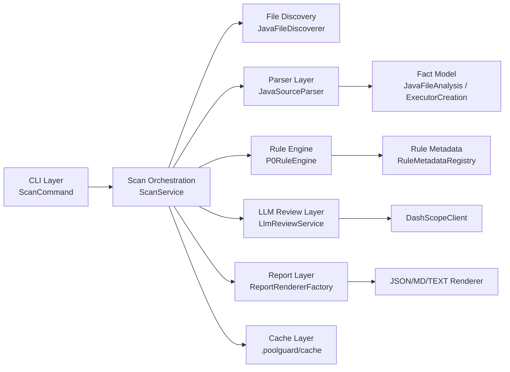
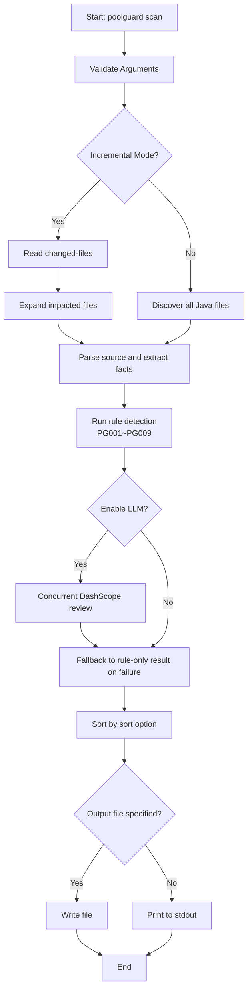

# PoolGuard

PoolGuard is a CLI tool for detecting thread pool leak risks in Java projects, with the first release focused on Spring Boot scenarios.

## Architecture



## Workflow



## Scope

- Scans only `.java` files, with JavaParser as the fixed parser.
- Output formats: `json` (default), `md` (fixed `md-template-v1`), `text`.
- Fixed LLM provider: DashScope; default model: `glm-5`; override with `--llm-model`.
- Configurable LLM concurrency via `--llm-concurrency`, default `3`.
- Supports full scan and incremental scan (`--changed-files`).
- Supports file hash cache (`.poolguard/cache/file-hash.properties`).

## Implemented Rules

Note: 8 rules are currently active. IDs are kept as `PG001 ~ PG009` (`PG004` is reserved and not enabled).

- `PG001`: Creating thread pools in high-frequency entry methods  
  Example: Creating `Executors.newFixedThreadPool(...)` on every request in a Spring `@RestController` endpoint.
- `PG002`: Repeated thread pool creation in loops/recursion  
  Example: Repeated `new ThreadPoolExecutor(...)` in `for/while` retry loops or recursive methods.
- `PG003`: Missing or incomplete shutdown path  
  Example: Method creates `ExecutorService` and returns directly; exception path never reaches `finally` for `shutdown()`.
- `PG005`: Lifecycle mismatch (short-lived object holds a thread pool)  
  Example: Request-scoped object or temporary service holds an executor field, but no `@PreDestroy`/`close` cleanup exists.
- `PG006`: Default thread factory lacks observability  
  Example: Directly using `Executors.newCachedThreadPool()` with default thread names that are hard to trace in production.
- `PG007`: Unbounded queue risk (`LinkedBlockingQueue()`)  
  Example: `ThreadPoolExecutor` with `new LinkedBlockingQueue<>()` (no capacity), causing unbounded backlog under load.
- `PG008`: Scheduled pool tasks not canceled and pool not shut down  
  Example: After `scheduleAtFixedRate(...)`, neither `future.cancel(...)` nor `shutdown()` is called.
- `PG009`: Static thread pool without shutdown hook  
  Example: `private static final ExecutorService POOL = ...` without shutdown hook or destroy method at app stop.

## Risk Score Baseline

Current `risk_score` is a rule default score (not dynamically calculated at runtime), used for sorting and quick triage:

- `CRITICAL`: `90-95` (high probability of true leak, large impact)
- `HIGH`: `75-89` (high risk, should be prioritized)
- `MEDIUM`: `55-69` (optimization-level issue, usually non-blocking)

Current defaults:

- `PG001=80`
- `PG002=92`
- `PG003=95`
- `PG005=78`
- `PG006=60`
- `PG007=84`
- `PG008=80`
- `PG009=83`

## Requirements

- JDK 8
- Maven 3.8+

## Quick Start

```bash
mvn clean package
```

```bash
# Default JSON output to stdout
java -cp target/classes:$(mvn -q -DincludeScope=runtime dependency:build-classpath -Dmdep.path | tail -n 1) \
  cn.rqfreefly.Main scan --path .
```

## Using in IntelliJ IDEA

1. Import project
- `File -> Open`, choose the project root `PoolGuard`.
- Wait for Maven auto-import to finish.

2. Configure JDK 8
- `File -> Project Structure -> Project SDK`: select JDK 1.8.
- `Settings -> Build Tools -> Maven -> Runner -> JRE`: also select JDK 1.8.

3. Run main program
- Open [Main.java](/Users/rongqing/Documents/code/PoolGuard/src/main/java/cn/rqfreefly/Main.java).
- Run `Main.main()` and set `Program arguments` in Run Configuration.
- Common examples:
```text
scan --path . --format json
scan --path . --format md --output report.md
scan --path . --changed-files changed.txt --format json
```

4. Enable LLM (optional)
- Add environment variable in `Run Configuration -> Environment variables`:
```text
DASHSCOPE_API_KEY=<your_api_key>
```
- Example arguments:
```text
scan --path . --enable-llm --llm-model glm-5 --llm-concurrency 3
```

5. Run tests and quality gates in IDEA
- In Maven panel:
```text
Lifecycle -> test
Lifecycle -> verify
```
- `verify` runs JaCoCo coverage gates and Checkstyle checks.

## CLI Usage

```bash
poolguard --help
poolguard scan --help
```

Core options:

- `--path <dir|file>`: scan path
- `--format <json|md|text>`: output format, default `json`
- `--output <file>`: write output to file; if omitted, print to stdout
- `--sort <severity|score|path>`: sort mode, default `severity`
- `--changed-files <file>`: incremental file list
- `--enable-llm`: enable DashScope review
- `--llm-model <name>`: LLM model name, default `glm-5`
- `--llm-concurrency <n>`: LLM concurrency, default `3`

## Incremental Scan

Example `--changed-files` file (supports relative/absolute paths, one per line):

```text
src/main/java/com/example/A.java
src/main/java/com/example/B.java
```

Run:

```bash
poolguard scan --path . --changed-files changed.txt --format json
```

Strategy:

1. Read changed file set.
2. Extract declared method names from changed files.
3. Expand call-site candidates in repository (one-hop text-based expansion).
4. Scan changed files + impacted files only.

## LLM Configuration (DashScope)

Ensure environment variable is set before execution:

```bash
export DASHSCOPE_API_KEY="<your_key>"
```

Refresh shell environment:

```bash
source ~/.zshrc
```

Enable LLM:

```bash
poolguard scan --path . --enable-llm --llm-model glm-5 --llm-concurrency 3
```

LLM failure strategy:

- Retries automatically on timeout, `429`, and `5xx` (exponential backoff).
- Falls back to rule-only results after retry limit, without interrupting CLI.
- Uses `enable_thinking=false` by default to reduce latency.

## Report Output

### JSON (default)

Includes: metadata, scan summary, severity counts, issue details.

### Markdown (`md-template-v1`)

Fixed structure:

1. Metadata
2. Scan summary
3. Issue details (grouped by severity)
4. Fix suggestion summary

### Text

Best for quick terminal viewing.

## Exit Codes

- `0`: success
- `2`: argument error
- `3`: execution error

## Development & Test

```bash
mvn clean compile
mvn test
mvn clean package
```

Recommended before commit:

```bash
mvn -q clean verify
```

## Quality Gates (Coverage & Comment Density)

This project uses:

- `JaCoCo`: coverage checks in `verify`, hard gate `LINE >= 70%`.
- `Checkstyle`: baseline code style checks in `verify`.
- `SonarQube`: comment density gate (Comment Lines Density).

Local hard-gate command:

```bash
mvn clean verify
```

Sonar scan command (example):

```bash
mvn clean verify sonar:sonar \
  -Dsonar.host.url=http://<sonar-host>:9000 \
  -Dsonar.login=<token> \
  -Dsonar.projectKey=poolguard
```

Configure in SonarQube quality gate:

- `Comment Lines Density >= 30%`
- `Coverage >= 70%`

Note: strong enforcement of comment density depends on SonarQube quality gate; local Maven primarily enforces test coverage and coding standards.

## Known Limitations

- Current incremental call-chain expansion is one-hop text strategy, not a full cross-module static call graph.
- SARIF output is not implemented.
- LLM is used only for candidate review and suggestion enhancement; it does not replace the rule engine.

## Project Structure

- `src/main/java/cn/rqfreefly/cli`: CLI command definitions
- `src/main/java/cn/rqfreefly/parser`: JavaParser parsing and fact extraction
- `src/main/java/cn/rqfreefly/analyzer`: rule engine, scan orchestration, cache, incremental scanning
- `src/main/java/cn/rqfreefly/llm`: DashScope client and concurrent review
- `src/main/java/cn/rqfreefly/report`: JSON/MD/TEXT rendering
- `src/main/resources/rules`: rule metadata
- `src/test/java`: JUnit5 tests
